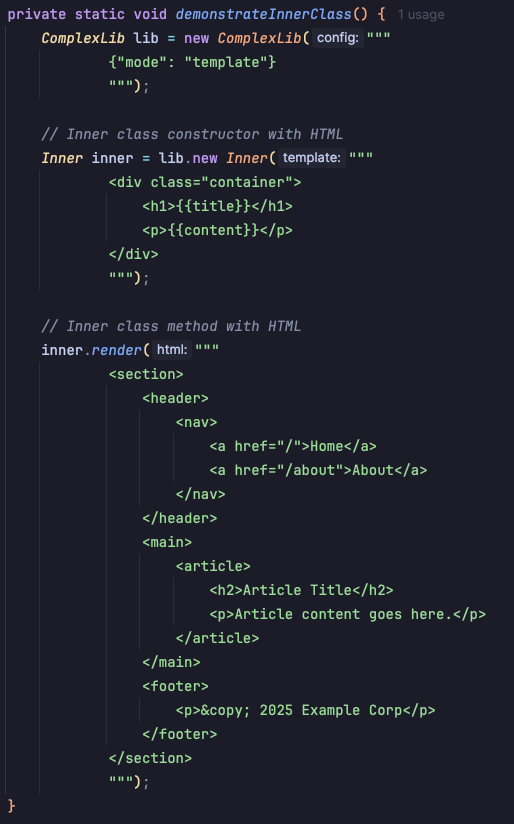
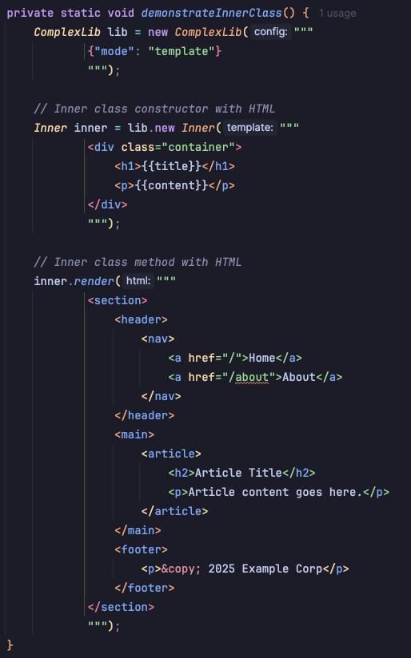

<p align="right">
<a href="https://autorelease.general.dmz.palantir.tech/palantir/gradle-idea-language-injector"></a>
</p>

# Gradle IDEA Language Injector

A Gradle plugin that automatically generates IntelliJ IDEA language injection configurations for `@Language` annotations in external library dependencies.

## Problem

IntelliJ IDEA [does not recognize `@Language` annotations from external libraries](https://youtrack.jetbrains.com/issue/IDEA-303529), preventing syntax highlighting and code completion for SQL, HTML, JSON, etc. in annotated string parameters. Ideally this plugin should not exist and would not be needed if the intellij bug is fixed.

**Example:** A library with `public void query(@Language("SQL") String sql)` won't provide SQL highlighting when you call it, even though the annotation exists in the JAR.

### Before:


## Solution

This plugin scans dependency JARs at build time, extracts `@Language` metadata, and generates `.idea/IntelliLang.xml` so IntelliJ can provide language injection support for external libraries.

### After:


## Usage

Add to `settings.gradle`:

```groovy
plugins {
    id 'com.palantir.idea-language-injector' version '<version>'
}
```

The plugin runs automatically during IntelliJ IDEA sync. Language injections are immediately available after syncing.
